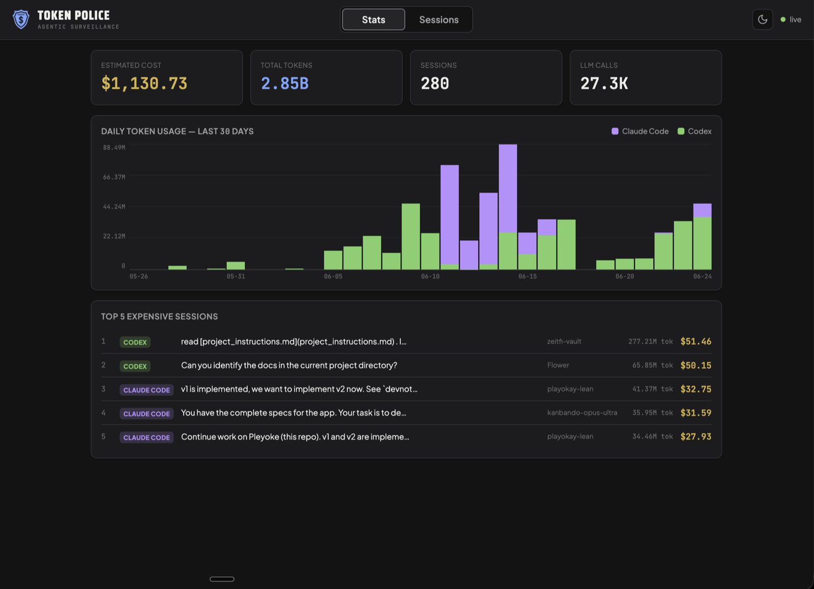
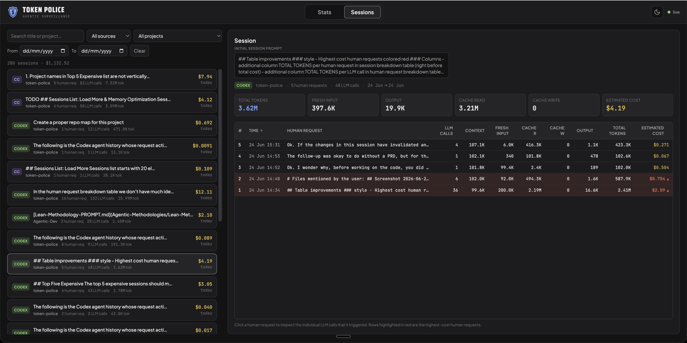
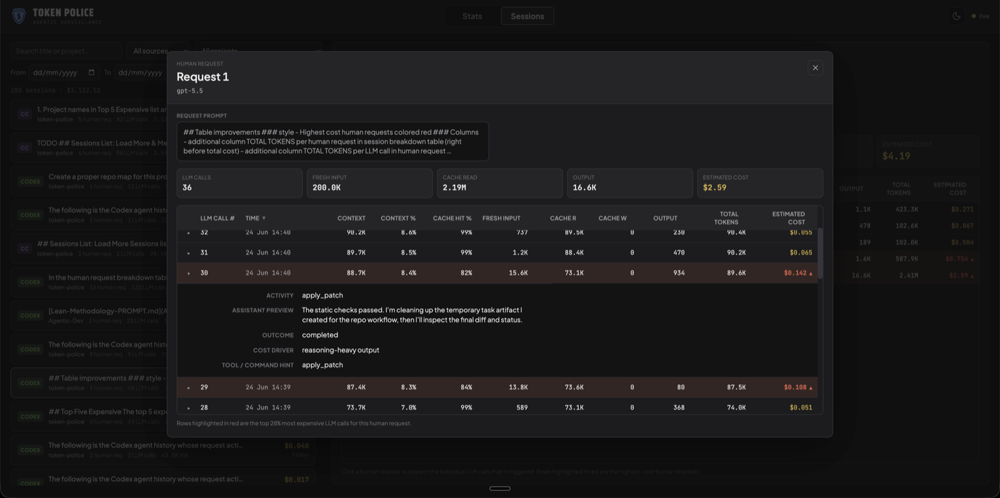

# Token Police

A self-contained **local** web dashboard for tracking token usage and estimated cost across
**Claude Code** and **Codex CLI** sessions. It groups each transcript into human
requests and the LLM calls they triggered. All data stays on your machine —
nothing is uploaded, no accounts, no telemetry.

 



## What it does

- Parses every Claude Code transcript in `~/.claude/projects/**/*.jsonl` and every
  Codex session in `~/.codex/sessions/**/*.jsonl`.
- Watches those directories and updates live while Claude Code / Codex are running.
- Prices each LLM call using live rates from
  [LiteLLM](https://github.com/BerriAI/litellm) (cached on disk for 1 hour, with a
  hardcoded fallback if the fetch fails).
- Serves a dark-mode dashboard at **http://localhost:7899**.

## Quick start

```bash
npm start
```

`npm start` installs dependencies if they are missing, starts the server, and
opens your browser automatically. That's the only command you need.

> Requires **Node.js 18+** (uses the built-in `fetch`). Check with `node --version`.

If you prefer to do it manually:

```bash
npm install
npm start
```

To start without auto-opening the browser, or on a different port:

```bash
DASH_NO_OPEN=1 PORT=8080 npm start
```

## The UI

- **Overview** — estimated cost & tokens, a stacked daily-usage chart for the last 30
  days (split by source), and the top 5 Sessions by estimated cost.
- **Sessions list** — every Session sorted by last activity, with a
  source badge (`CC` / `Codex`), project, title, estimated cost, tokens, human request
  count, and LLM call count. Filter by source, project, free-text search, and
  date range.
- **Session detail** — click any Session to see its totals plus a table
  of human requests, including subtotaled fresh input, cache read, output,
  cache write, LLM call count, and estimated cost.
- **LLM call dialog** — click a human request to inspect the individual LLM calls
  it triggered. **The top 20% most expensive calls in that request are
  highlighted in red.**

The page auto-refreshes every 30 seconds, so it stays current while you work.

The Sessions list and Session detail side by side — filter on the left, totals and the
per-Human-request breakdown on the right:



Inside the LLM call dialog, the top 20% most expensive calls for that human request are
highlighted in red:



## REST API

The same server exposes a small JSON API (handy for scripting):

| Endpoint | Description |
| --- | --- |
| `GET /api/sessions` | All Sessions with totals. |
| `GET /api/sessions/:id/llm-calls` | Every LLM call for one Session, including its parent Human request. |
| `GET /api/summary` | Aggregate totals, per-source totals, 30-day daily breakdown, top 5. |
| `GET /api/health` | Liveness check. |

## How tokens & estimated cost are computed

Both providers are normalized to four **disjoint** token buckets — `input`
(fresh input), `output`, `cache_read`, `cache_write` — so one estimated-cost formula works
for both:

- **Claude Code** (`message.usage`): `input_tokens` already excludes cache;
  `cache_creation_input_tokens` → cache write, `cache_read_input_tokens` → cache read.
- **Codex** (`token_count` events): OpenAI's `input_tokens` *includes*
  `cached_input_tokens`, so fresh input = `input_tokens − cached_input_tokens`,
  and `cached_input_tokens` → cache read (OpenAI has no separate cache-write price).
  Per-call values come from `last_token_usage`; when absent they are recovered by
  subtracting the previous cumulative total. Repeated/rate-limit `token_count`
  pings are de-duplicated by only counting events where the cumulative total changes.

Estimated costs use the `model` recorded in each LLM call, falling back to
`claude-sonnet-4-5` rates for unrecognized models. Synthetic/local calls are
billed at $0.

## Project layout

```
/.
├── start.js            # bootstrap: installs deps if missing, then starts server
├── server.js           # Express app + REST endpoints + startup wiring
├── src/
│   ├── pricing.js      # LiteLLM fetch/cache + estimated-cost calculation
│   ├── parseClaude.js  # Claude Code transcript parser
│   ├── parseCodex.js   # Codex session parser
│   ├── store.js        # in-memory store + aggregation + summary
│   └── watcher.js      # chokidar watchers (recursive, handles missing dirs)
├── public/             # static dark-mode frontend (HTML/CSS/vanilla JS)
└── README.md
```

## Notes

- Malformed JSONL lines are skipped silently; a bad line never crashes a parse.
- If `~/.claude/projects` or `~/.codex/sessions` doesn't exist yet, the server
  polls for it and starts watching once it appears.
- The browser only ever talks to this local API — it makes no external network calls.
