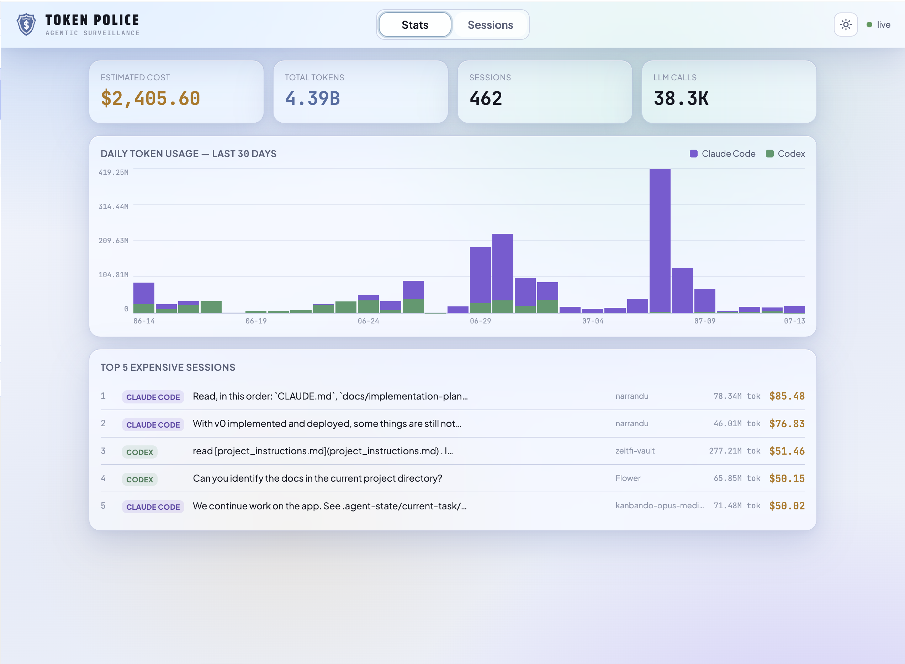
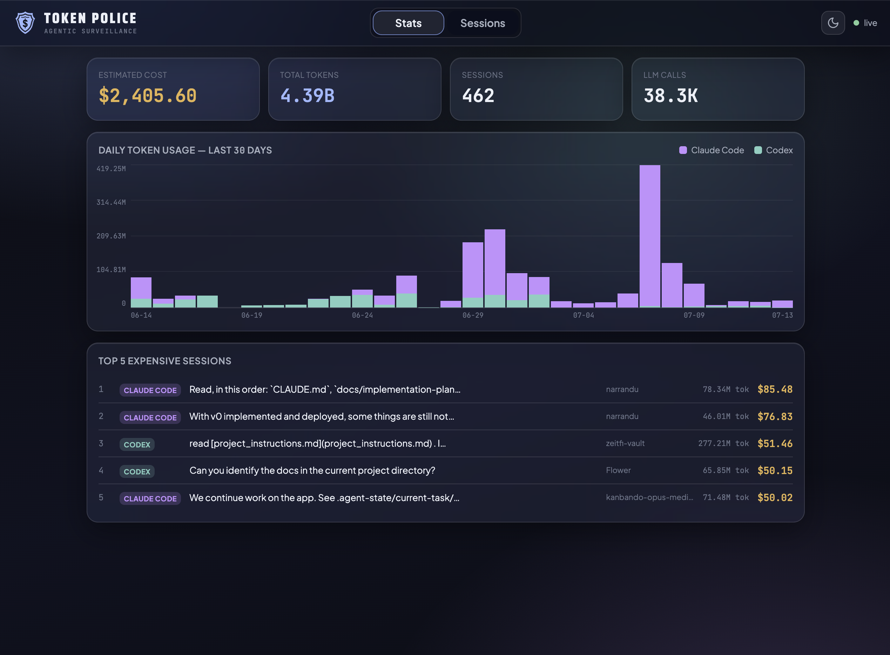
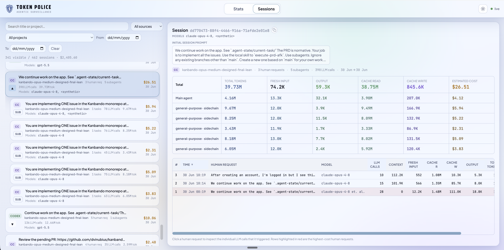
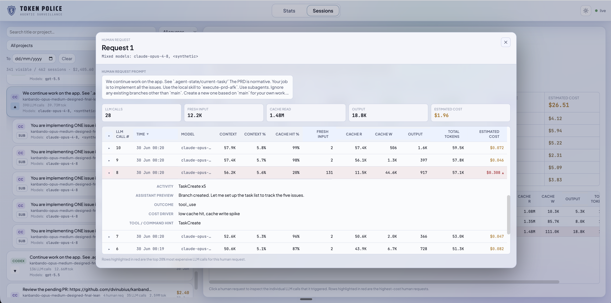
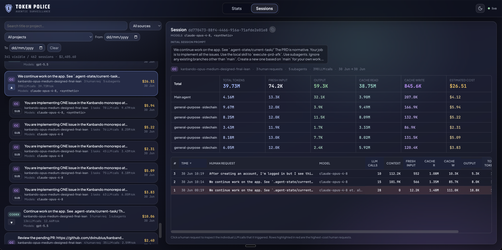
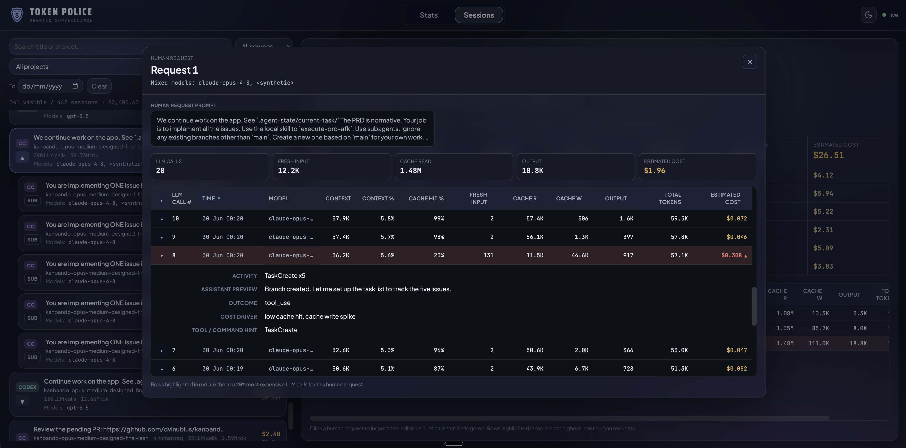

# Token Police

Token Police is a local dashboard for tracking token usage and Estimated cost
across Claude Code and Codex CLI Sessions. It groups provider transcripts into
Human requests and the LLM calls they triggered; transcript contents remain on
the local machine.

## Dashboard





### Session inspection









## Architecture

The Node.js server watches local transcript directories, normalizes provider
records into an in-memory read model, enriches LLM calls with LiteLLM pricing
and context data, and serves a Svelte dashboard plus a read-only JSON API on
`127.0.0.1:7899` by default. See the
[accepted architecture](docs/normative/architecture.md) for component
boundaries, data flow, and API surfaces.

## Documentation

- [Normative technical documentation](docs/normative/README.md)
- [Repository map](docs/repository-map.md)
- [Development commands](docs/development-commands.md)
- [Domain language](docs/domain-language.md)
- [Product and interface design](design/product-brief.md)
- [Lean agentic development guide](.agent/how-to.md)

## Development

```text
install:      npm install
dev:          npm run server      # Express API + existing static dist; no rebuild
frontend:     npm run dev         # Vite dev server with /api proxy
build:        npm run build       # frontend/ -> dist/
start:        npm start           # build, serve dist/, and open the browser
test:focused: npm test -- test/llm-insights.test.js
test:full:    npm test
coverage:     npm run coverage
health:       npm run health
```

Requires Node.js 18 or newer. Run `npm install` before `npm start`; the start
script builds the frontend before the bootstrap launcher checks runtime
dependencies. Set `DASH_NO_OPEN=1` to suppress browser opening, or override
`HOST` and `PORT` for the local server.
